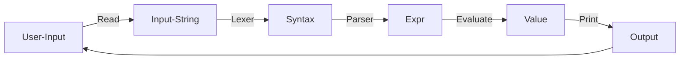

## Project 4: Scheme Interpreter

> SJTU CS1958-01 2024Fall 第四次大作业
>
> 本次大作业基于 SJTU CS1958-01 2023 Fall 第四次大作业改造而来，感谢陆潇扬学长与赵天朗学长！

作业提交截止时间：2024.12.24 18:00（暂定）

### 内容简介

在本次大作业中，你需要使用 C++ 实现一个简易的 Scheme 解释器。

#### Scheme

Scheme 是一种函数式语言，它主要有两种特性：

- 采用 S-表达式，除了 `Integer` 、`Boolean` 类型与变量 `var`，其余语法形如 `(expr exprs ...)`，例如 `(+ 1 3)`
- 函数也被视作一个变量

如果你对 Scheme 感兴趣，可以在网上自行查阅相关信息。本次大作业并不需要你实现 Scheme 所有的功能，因此阅读文档即可完成所有的需求。

#### 解释器

在 REPL（Read-Evaluate-Print Loop）交互模式下， 用户输入的程序在输入时会被认为是一个完整的字符串， 这个字符串经过 Lexer 处理后分解成一个个的 tokens。 之后， 这些 tokens 会在 Parser 的作用下生成 AST（Abstract Syntax Tree， 抽象语法树）， 最终 AST 被交给求值部分进行求值并输出。

在我们提供的接口中， 已经为你实现了 Lexer 的部分， 由于 Scheme 的特性， 这些拆分出来的 tokens 已经组成了一个类似于 AST 的结构， 这就是 `Syntax`。



### 项目框架

#### 编译

我们已经为你提供了 `CMakeLists.txt`， 要编译整个项目， 在根目录下输入

```
cmake -B build
cmake --build build --target code
```

之后， `code` 程序会生成在子目录 `bin` 下， 在根目录下执行

```
./code
```

来运行你的解释器。

#### 代码实现

`src` 下文件为：

```
├── src
│   ├── shared.hpp
│   ├── parser.cpp
│   ├── evaluation.cpp
│   ├── main.cpp
│   ├── Def.hpp
│   ├── Def.cpp
│   ├── syntax.hpp
│   ├── syntax.cpp
│   ├── expr.hpp
│   ├── expr.cpp
│   ├── value.hpp
│   ├── value.cpp
│   ├── RE.hpp
│   ├── RE.cpp
│   ├── expr.hpp
│   └── expr.cpp
```

其中

```
├── src
│   ├── shared.hpp
│   ├── parser.cpp
│   └── evaluation.cpp
```

为你需要修改的文件

- `shared.hpp` 为 SmartPointer 作业中你实现的 `SharedPtr` 

> 对， 我们希望你能够使用自己的 `SharedPtr` 而不是 STL 的 `shared_ptr`， 至于为什么要用 `shared_ptr` 你可以思考一下）

- `parser.cpp` 是你需要实现的 Parser 部分， 你需要填写所有的 `parse()` 函数
- `evaluation.cpp` 是你需要实现的 Evaluation 部分， 你需要填写所有的 `eval()` 函数
- 如有需要，你也可以在其它文件中进行改动

对于其他的文件， 它们的用处分别为

- `Def.hpp`： 声明需要用到的类型、枚举类型和辅助函数
- `Def.cpp`： 定义了辅助函数和两个 `map`， 其中 `primitive` 用来存 `library` 函数的关键字， `reserved_words` 存其他语法的关键字（希望这两个函数和枚举类型能对你有所帮助， 当然你也可以不用我们提供的工具自己实现所有的功能， it's up to you）
- `RE.hpp` 与 `RE.cpp`： 定义了需要报错时需要使用的异常类型， 你需要学习异常类型的使用， 具体可以看[这里](https://www.runoob.com/cplusplus/cpp-exceptions-handling.html)
- `syntax.hpp` 与 `syntax.cpp`： 定义了所有的 `Syntax` 和[子类](https://www.runoob.com/cplusplus/cpp-inheritance.html)， 具体实现在 `syntax.cpp` 中
- `expr.hpp` 与 `expr.cpp`： 定义了所有的 `Expr` 和子类， 子类的构造函数在 `expr.cpp` 中
- `value.hpp` 与 `value.cpp`： 定义了所有的 `Value` 和子类， 子类的构造函数和输出方式在 `value.cpp` 中； 此外， 我们提到的作用域， 被实现在 `Assoc` 和 `AssocList` 中， 具体可以参考这两个文件
- `main.cpp`： REPL 的执行部分

#### 评测

在 OJ 上进行提交测评， 我们也会下发部分数据来帮助你在本地进行调试。

具体而言， 你只需要在代码提交页面输入 `git` 仓库的地址。

#### 调试

在完成编译后，你可以运行你的解释器，并自行输入 Scheme 语言，检查你的解释器行为是否符合预期。

同时，我们在 repo 中提供了评测程序来对你的解释器进行本地测评， 评测程序在子目录 `score` 下， 评测数据在子目录 `score/data` 下。

具体而言， 评测程序会执行你的解释器并将结果与标准程序的输出进行比对， 要使用评测程序， 在子目录 `score` 下执行以下命令即可

```
./score.sh
```

若权限不够， 你可以输入下列命令后再执行

```
chmod +x score.sh
./score.sh
```

脚本中有两行

```
L = 1
R = 119
```

你可以将这两个变量改为任意数字来对给定范围内的测试点进行测评。

请合理利用本地的评测程序进行调试。

### 任务

总得来说，你的解释器应当可以接受以下语法：

```
expr   -->  Integer
	|   Boolean
        |   (quote datum)
        |   var
        |   (if expr expr expr)
        |   (begin expr*)
        |   (lambda (var*) expr)
        |   (let ([var expr]*) expr)
        |   (letrec ([var expr]*) expr)
        |   (expr expr*)
```

对每一个输入的表达式， 你需要求出表达式的值， 值的类型有以下几种（可见于 `src/value.hpp`）

- `Integer`： 整数
- `Void`： `(void)` 时输出的值
- `Boolean`： 布尔值
- `Symbol`： 符号
- `Null`： 空 `Pair`（你可以认为是 C++ 中的 NULL）
- `Pair`： 值对， 由两个值构成
- `Terminate`： `(exit)` 函数的值， 负责退出整个程序
- `Closure`： 用户定义的函数

语法中的 `primitive` 为 Library 中定义的函数（你可以认为 Library 是 C++ 的 STL， 你同样需要实现这一部分函数的解释执行）。

#### 子任务 1（10pts）：计算器

我们从实现一个简易的计算器开始，在该子任务中，你的解释器应当可以接受以下语法：

```
expr   -->  Integer
        |   (primitive expr*)
```

##### 语法：`Integer`

在该子任务中，`constant` 表示整数，对应类型为 `Integer` 的值。在本次大作业中，你可以认为 `Integer` 就是 C++ 中的 `int`，你不需要考虑溢出等情况。

样例：

```
scm> 100
100
scm> -1
-1
```

##### 语法：`(primitive expr*)`

该子任务中，`primitive` 语法包含以下几种情况：

```
-->	(+ expr1 expr2)
 |	(- expr1 expr2)
 |	(* expr1 expr2)
 |	(exit)
```

`(+ expr1 expr2)`、`(- expr1 expr2)`、`(* expr1 expr2)` 表示对应的整数运算，它们接收两个类型为 `Integer` 的参数，值为对应的运算结果，类型为 `Integer`。

`(exit)` 没有参数，它的值类型为 `Terminate`，当 `main.cpp` 读入当前 `syntax` 并经过 `parse` 与 `evaluate` 后得到的 `value` 类型为 `Terminate` 时，解释器会停止运行。

提示：在前三个子任务中，你只需要考虑 `primitive` 在 `(primitive expr*)` 中出现的情况。因此，你可以直接将 `syntax` parse 为对应的 `expr`（如 `/src/expr.hpp` 中的 `Plus` 等），然后进行相应的处理。

特别地，当 `primitive` 接收的参数个数或参数类型不符合要求时，你应当及时抛出异常（详见 `RE.hpp` 与 `main.cpp`）。**本次大作业不要求你抛出的异常指明具体的问题，你只需要抛出 `RuntimeError(str)` 即可，`str` 可以是任意字符串。**

样例：

```
scm> (+ 1 2)
3
scm> (- 1 2)
-1
scm> (* (+ 1 2) (- 1 2))
-3
scm> (+ 1 2 3)
RuntimeError
scm> (exit) // 程序终止
```

#### 子任务 2（10pts）：更多的数据类型

在该子任务中，我们将在上一子任务的基础上引入更多的数据类型以及对应的构造方式，你的解释器现在应当可以接受以下语法：

```
expr   -->  Integer
		| 	Boolean
		|	(quote datum)
		|   (primitive expr*)
```

`primitive` 在原来的基础上增加了 `void, cons, car, cdr`。

我们首先来介绍该子任务中涉及到的数据类型。

##### 数据类型：`Integer`

`Integer` 属于基础类型，在本次大作业中，其行为与 C++ 中的 `int` 类型表现一致。

##### 数据类型：`Boolean`

`Boolean` 即布尔值，在 Scheme 中，我们使用 `#t` 表示 True，使用 `#f` 表示 False。

##### 数据类型：`Pair`

`Pair` 即二元有序对，它有两个值组成。在 Scheme 中，我们使用 `(A . B)` 表示一个左值为 `A`，右值为 `B` 的 `Pair`。

组成 `Pair` 的两个值的类型可以是任意类型，甚至也可以是 `Pair`，例如 `((1 . 2) . (3 . 4))`，它表示一个左值为 `(1 . 2)`，右值为 `(3 . 4)` 的 `Pair`。通过这种嵌套，我们可以用 `Pair` 表示一棵二叉树，进而表示更多、更复杂的结构。例如，我们可以使用 `Pair` 表示这么一个结构 `[1, 2, 3, 4, 5]`：`(1 . (2 . (3 . (4 . 5))))`，Scheme 会将其简写为 `(1 2 3 4 . 5)`。

##### 数据类型：`Null`

`Null` 可以被理解为空 `Pair`。在 Scheme 中，我们使用 `()` 表示 `Null`。

结合 `Null` 与 `Pair`，我们可以在 Scheme 中表示 `List`。例如上面的例子，我们实际上会用 `(1 . (2 . (3 . (4 . (5 . ())))))` 来表示一个列表 `[1, 2, 3, 4, 5]`，Scheme 会将其简写为 `(1 2 3 4 5)`，这样我们就规避了 `.` 的出现。

##### 数据类型：`Symbol`

`Symbol` 可以被视为不可变的字符串。在 Scheme 中，我们使用 `quote` 来生成 `Symbol`，具体内容请见下方语法部分的解释。

我们可以使用 `Symbol`  起到类似 C++ 中 `enum` 类型的作用。例如，我们可以创建一个列表 `(left right up down)` 来表示四个方向，其中 `left`、`right`、`up`、`down` 都是类型为 `Symbol` 的值，它们的值即为自身。

`Symbol` 类型甚至使得我们可以用 Scheme 编写一个 Scheme 解释器，因为我们可以用 `Symbol` 类型表示一个个 token，且 Scheme 本身采用 S-表达式，这使得 Scheme 的表达式本身也是一个列表。

##### 数据类型：`Void`

`Void` 是一个很特殊的数据类型，当一个函数仅包含副作用时，它的值即为 `Void`。由于本次大作业中几乎表达式都没有副作用，因此 `Void` 只能由 `(void)` 这一表达式生成。Scheme 输出表达式的值时用 `#<void>` 表示 `Void` 类型。

##### 数据类型：`Closure`

`Closure` 用来表示用户自定义的函数。本次大作业中 `Closure` 表示函数本身以及对应的作用域。该子任务中不涉及 `Closure` 的相关操作。我们的 Scheme 输出表达式的值时用 `#<procedure>` 表示 `Closure` 类型。

现在我们逐个介绍该子任务中新增的语法。

##### 语法：`Boolean`

当表达式为 `#t` 或 `#f` 时，它的值即为 `#t` 与 `#f`（`Boolean` 类型）。

样例：

```
scm> #t
#t
scm> #f
#f
```

##### 语法：`(quote datum)`

注意，此处 `datum` 是一个 `syntax` 而非 `expr`。

`(quote datum)` 的作用是将 `datum` 原样返回。

`Integer` 与 `Boolean` 的情况很好理解。

对于 `Pair` 的情况，由于 Scheme 对一个列表求值时会将其视为调用函数（例如 `(+ 1 2)` 的值是 `3` 而非列表 `(+ 1 2)` 自身），所以我们可以通过 `(quote datum)` 直接构造一个 `Pair`（包括列表）。

对于 `Symbol` 的情况，由于 Scheme 对一个 `Identifier` 求值时会被认为取变量名为该 `Identifier` 对应的值（例如 `var` 的值是 `var` 变量对应的值而非 `var` 自身），所以我们可以通过 `(quote datum)` 直接构造一个 `Symbol`。

`(quote datum)` 的值是 `Integer`、`Boolean`、`Symbol`、`Pair` 中的一种，取决于 `datum` 的形式。

样例：

```
scm> (quote 1)
1 // 注意这里是 Integer 类型
scm> (quote #t)
#t // 注意这里是 Boolean 类型
scm> (quote (+ 1 2 3))
(+ 1 2 3) // 注意这里是 Pair 类型，其中 + 为 Symbol 类型，其它为 Integer 类型
scm> (quote (4 . 5))
(4 . 5) // 注意这里是 Pair 类型，左值为 4，右值为 5，都为 Integer 类型
scm> (quote scheme)
scheme // 注意这里是 Symbol 类型
```

##### 语法：`(primitive expr*)`

该子任务中，`primitive` 语法包含以下几种情况：

```
-->	(+ expr1 expr2)
 |	(- expr1 expr2)
 |	(* expr1 expr2)
 |	(exit)
 |	(void)
 |	(cons expr1 expr2)
 | 	(car expr)
 |	(cdr expr)
```

`(void)` 不接受任何参数，值为 `Void`。

`(cons expr1 expr2)` 表示构造一个 `Pair`，其左值为 `expr1` 的值，右值 `expr2` 的值。它接受两个任意类型的参数，返回对应的 `Pair`。

`(car expr)` 与 `(cdr expr)` 分别表示取一个 `Pair` 的左值和右值。它接受一个类型为 `Pair` 的参数，返回对应的结果。

样例：

```
scm> (void)
#<void>
scm> (cons 1 2)
(1 . 2)
scm> (car (cons 5 #f))
5
scm> (cdr (cons #t (void)))
#<void>
scm> (cdr (quote ((ll . lr) . (rl . rr))))
(rl . rr)
scm> (car (quote (+ - *)))
+
```

#### 子任务 3（15pts）：顺序结构、选择结构

在该子任务中，我们在前两个子任务的基础上引入了顺序结构与条件结构，为了更好地使用条件结构，我们还引入了一些 `primitive` 来对数据类型做比较或检查。该子任务中，你的解释器应当接受以下语法：

```
expr   -->  Integer
		|	Boolean
		|	(begin expr expr*)
		|	(if expr1 expr2 expr3)
		|	(quote datum)
        	|	(primitive expr*)
```

##### 语法：`(begin expr expr*)`

顺序结构。

`expr*` 表示可能 $0, 1, 2, \cdots$ 个 `expr`。

你需要从左至右依次执行 `expr`，而 `(begin expr expr*)` 的值为最右侧的 `expr` 的值。

由于本次大作业并不涉及含副作用的表达式，所以无法体现这一语法的作用。但是你仍然需要执行每个 `expr`，因为这些 `expr` 内可能包含非法情况。

样例：

```
scm> (begin 1)
1
scm> (begin (void) (cons 1 2) #t)
#t
```

#### 语法：`(if expr1 expr2 expr3)`

选择结构。

我们首先执行并求出 `expr1` 的值，若 `expr1` 的值为 `#f`，则执行 `expr3` ，该表达式的值为 `expr3` 的值；否则执行 `expr2`，该表达式的值为 `expr2` 的值。

**注意：与 C++ 不同的是，`0` 会被视为 `#t` 而非 `#f`。**

样例：

```
scm> (if 0 1 2)
1
scm> (if (< 2 1) #f #t) // (< 1 2) 的值见下一部分的内容
#t
scm> (if (void) undefined 1)
RuntimeError // 报错，undefined 变量未定义
scm> (if #f undefined 1)
1
```

#### 语法：`(primitive expr*)`

该子任务中，`primitive` 语法包含以下几种情况：

```
-->	(+ expr1 expr2)
 |	(- expr1 expr2)
 |	(* expr1 expr2)
 |	(exit)
 |	(void)
 |	(cons expr1 expr2)
 | 	(car expr)
 |	(cdr expr)
 |	(< expr1 expr2)
 |	(<= expr1 expr2)
 |	(= expr1 expr2)
 |	(>= expr1 expr2)
 |	(> expr1 expr2)
 |	(not expr)
 |	(fixnum? expr)
 |	(boolean? expr)
 |	(null? expr)
 |	(pair? expr)
 |	(symbol? expr)
 |	(eq? expr1 expr2)
```

`(< expr1 expr2)`、`(<= expr1 expr2)`、`(= expr1 expr2)`、`(>= expr1 expr2)`、`(> expr1 expr2)` 表示对应的整数比较。它们接受两个类型为 `Integer` 的参数，值为对应的比较结果，类型为 `Boolean`。

`(not expr)` 表示取反操作。它接受一个任意类型的参数，值为对应的取反结果，类型为 `Boolean`。当 `expr` 的值为 `#f` 时，该表达式的值为 `#t`，否则为 `#f`。请注意，它与 `(if expr1 expr2 expr3)` 一样，将 `0` 视为 `#t`。

`(fixnum? expr)`、`(boolean? expr)`、`(null? expr)`、`(pair? expr)`、`(symbol? expr)` 分别表示 `expr` 的值的类型是否为 `Integer`、`Boolean`、`Null`、`Pair`、`Symbol`。它们接受一个任意类型的参数，值为对应的结果，类型为 `Boolean`。

`(eq? expr1 expr2)` 表示检查 `expr1` 与 `expr2` 的值是否相等。该表达式接受两个任意类型的参数，值为对应的结果，类型为 `Boolean`。具体的比较规则：

- 若两个参数的类型都为 `Integer`，则比较对应的整数是否相同
- 若两个参数的类型都为 `Boolean`，则比较对应的布尔值是否相同
- 若两个参数的类型都为 `Symbol`，则比较对应的字符串是否相同
- 若两个参数的类型都为 `Null` 或都为 `Void`，则值为 `#t`
- 否则，比较两个值指向的内存位置是否相同（例如两个 `Pair`，即使它们左右值都相等，但如果内存位置不同，我们也认为两者不同）

我们提供的接口中存的是指向值的指针而非值本身， 你可以通过定义 `Value v` 并使用 `v.get()` 来查看 `v` 指向的内存位置。

样例：

```
scm> (< 1 2)
#t
scm> (>= 1 2)
#f
scm> (= #t 1)
RuntimeError // expr1 的类型不匹配
scm> (not #f)
#t
scm> (not (void))
#f
scm> (pair? (car (cons 1 2)))
#f
scm> (symbol? (quote var))
#t
scm> (fixnum? (+ 5 1))
#t
scm> (null? (quote ()))
#t
scm> (eq? 3 (+ 1 2))
#t
scm> (eq? #t (= 0 0))
#t
scm> (eq? (quote ()) (quote ()))
#t
scm> (eq? (quote (1 2 3)) (quote (1 2 3)))
#f
```

#### 子任务 4（25pts）：变量、作用域、函数

在该子任务中，我们在前面的基础上引入了作用域的概念，并在语法中引入了变量与函数。现在你的解释器应当接受以下语法：

```
expr   -->  Integer
		|	Boolean
		|	var
		|	(begin expr expr*)
		|	(if expr1 expr2 expr3)
		|	(quote datum)
		|	(lambda (var*) expr)
		|	(expr expr*)
```

在介绍语法前，我们首先介绍一下作用域与闭包的概念。

作用域实际上就是若干个变量与它们绑定的值的集合。具体实现中，我们用链表表示作用域，链表的元素是一个有序对，左值为变量名，右值为该变量对应的值（见 `/src/value.hpp` 中的 `AssocList` 与 `Assoc`）。当我们需要往作用域中引入新变量时，直接在链表头部插入，查询变量时从头部开始遍历。可以发现，这样我们就实现了所谓的 shadow，即重名变量的遮蔽。

闭包可以被理解为函数 + 作用域。函数与其它表达式不同之处在于，当我们对函数调用求值时，它内部的作用域与当前的作用域不同。例如表达式

```scheme
(let ([x (quote inner)])
	(let ([func (lambda () x)])
      	(let ([x (quote outer)]) (func))))
```

的值应当为 `inner` 而非 `outer`。因此，我们还要对每个函数记录定义该函数时所处的作用域。

在前面的子任务中，我们将 `primitive` 视为一种语法。实际上在 Scheme 中，`primitive` 也是函数，它们是在空作用域上定义的函数，并且应当是全局作用域中的变量。现在，我们要求你的解释器也对 `primitive` 这么处理。如此一来，`(primitive expr*)` 的语法也是函数调用语法 `(expr expr*)` 的一个子集，因此我们将其从语法中删去。

除此之外，该子任务中额外引入了一个 `primitive`，为 `(procedure? expr)`，用于检查一个值的类型是否为 `Closure`，其接受一个任意类型的参数，值为对应的结果，类型为 `Boolean`。

##### 语法：`var`

`var` 即变量，它的值可以是任意类型，取决于当前作用域中它对应的值。

任何 `Identifier` 都可以被解释成 `var`，包括 `primitives` 与 `reserve_words` 中的字符串，例如 `+` 与 `quote` 也可以是变量名。

变量名可以包含大小写字母（Scheme 对大小写敏感）、数字以及 `?!.+-*/<=>:$%&_~@` 中的字符。**在本次大作业中，我们规定：**

- **变量名的第一个字符不能为数字、`.@` 中的字符**
- **如果字符串可以被识别为一个数字，那么它会被优先识别为数字**，例如 `1`、`-1`、`+123`、`.123`、`+124.`、`1e-3`

注意：

- 当该变量在当前作用域未定义时，你的解释器应当输出 `RuntimeError`
- 变量名可以与 `primitives`、`reserve_words` 重合
- 变量名中的字符可以为除了 `#`、`'`、`"`、` 任意非空白字符，但第一个字符不能为数字

样例：

```
scm> void // void 变量在当前作用域未定义
RuntimeError
scm> + // + 作为 primitive，是一个函数
#<procedure>
scm> ((if #t + -) 1 2) // (if #t + -) 的值为 +，然后调用进行函数调用
3
scm> (let ([+ 1]) +) // + 在 let 中的作用域内是一个变量，它对应的值为 1
1
scm> (let ([x (lambda (y) y)]) x)
#<procedure>
```

##### 语法：`(lambda (var*) expr)`

`(lambda (var*) expr)` 表示定义了一个函数，它的值应为 `Closure`，`(var*)` 为其参数列表，`expr` 为其函数体。

注意：

- 此处我们不对 `expr` 执行与求值，因此即使 `expr` 中有不合法的情况，也不应当报错（而是在调用时报错）

样例：

```
scm> (lambda (x y) (+ x y))
#<procedure>
scm> (lambda () (void))
#<procedure>
scm> (lambda (void) undefined)
#<procedure>
```

##### 语法：`(expr expr*)`

`(expr expr*)` 表示函数调用，其中 `expr` 的类型应为 `Closure`，`expr*` 的数量应与 `expr` 对应的函数参数数量相等，否则你的解释器应该输出 `RuntimeError`。若 `expr` 为 `primitive`，那么你还需要检查参数类型是否满足要求。

假设 `expr` 对应的 `Clorsure` 类型为 `clos`。在求值时，我们首先在当前作用域对 `expr*` 进行求值，将其与 `expr` 中对应的形参绑定后将其加入 `clos` 的作用域中，形成一个新的作用域，然后在这个新的作用域下对 `clos` 内部的函数体进行求值。

这一语法对应了 `/src/value.hpp` 中的 `Apply`。

样例：

```
scm> ((lambda (x y) (* x y)) 10 11)
110
scm> (- 10 5)
5
scm> (((if #t (lambda () +) (lambda () -))) 1 2)
3
scm> ((lambda () undefined)) // undefined 未定义
RuntimeError
```

#### 子任务 5（25pts）：绑定变量

截至目前，我们的解释器还无法方便地引入新变量，但当我们加入 `let` 与 `letrec` 后就可以实现这一点了。在该子任务中，你的解释器应当接受以下语法：

```
expr   -->  Integer
		|	Boolean
		|	var
		|	(begin expr expr*)
		|	(if expr1 expr2 expr3)
		|	(quote datum)
		|	(lambda (var*) expr)
		|	(expr expr*)
		|	(let ([var expr]*) expr)
		|	(letrec ([var expr]*) expr)
```

简单来说，新增的两条语法都是在做两件事：首先在当前作用域的基础上创建一个新作用域，并按照某种特定规则引入变量，然后在新作用域上对 `expr` 进行求值。

##### 语法：`(let ([var expr]*) expr)`

我们首先在当前作用域下依次求出 `expr*` （即 `var` 后面的 `expr` 们）的值，然后在当前作用域的基础上创建一个新作用域，并将变量 `var*` 与它们对应的值引入新作用域，最后在新作用域下对 `expr` 进行求值。

样例：

```
scm> (let ([x 1] [y 1]) (+ x y))
2
scm> (let ([x 1] [y x]) (+ x y)) // 对 y 对应的表达式求值时，作用域里不包含 x 这个变量
RuntimeError
scm> (let ([x 1]) (let ([y x] [x 3]) (+ x y)))
4
scm> (let ([x 3]) (let ([x 1] [y x]) y))
3
scm> (let ([+ 1]) +)
1
scm> (let ([+ -]) (+ 2 1))
1
```

##### 语法：`(letrec ([var expr]*) expr)`

我们尝试用 `let` 语法实现一个求阶乘的递归函数 `fact`：

```scheme
(let
	([fact
      	(lambda (n)
          	(if (= n 0)
				1
                (* n (fact (- n 1)))))])
	(fact 5))
```

考虑 `fact` 这一 `Closure` 内部的作用域，可以发现该作用域并不包含 `fact`，于是上述表达式会得到 `RuntimeError`。

这就是 `let` 语法的不足，它不支持我们在求 `var` 的值时调用别的 `var`。

我们来看 `letrec` 是如何解决这一问题的：首先在当前作用域的基础上创建一个新作用域 `env1`，将 `var*` 与 `Value(nullptr)`（表示定义了该变量，但无法使用）绑定并引入 `env1`；然后在 `env1` 下对 `expr*` 求值，并在 `env1` 的基础上创建一个新作用域 `env2`，将 `var*` 与其对应的值绑定并引入 `env2`；最后在 `env2` 下对 `expr*` 求值。

你可能会好奇“定义了该变量但无法使用”跟不定义这个变量有什么区别，确实，在这种情况

```scheme
(letrec
	([a 1]
     [b a])
	b)
```

下并没有用，因为变量 `a` 虽然被定义但无法使用，你的解释器仍然应该输出 `RuntimeError`。但如果 `b` 绑定的是个 `Closure` 呢？例如

```scheme
(letrec
	([a 1]
     [b (lambda () a)])
	(b))
```

，此时你的解释器应该输出 `1`。因为 `(lambda () a)` 是个 `Closure`，我们并不会在定义时对它的函数体 `a` 执行与求值，所以解释器不会报错；而当我们真正对 `a` 求值时，所处的作用域 `env2` 里变量 `a` 对应的值即为 `1`，因此没有任何问题。

样例：请参考以上求阶乘的例子。

#### Q & A（10pts）

我们会对你的实现思路与关键步骤进行提问，检查你对你的代码是否熟悉。

#### Coding Convention（5pts）

我们会检查你的代码是否规范，包括但不限于清晰的命名、适当的注释、合理的缩进。

#### Bonus

至此你已经能够得到最高100pt的总分。完成以下bonus可以让你得到附加分。bonus可以叠加，分数可以溢出。
1. 编写强壮的数据点，使得：
   	- 标准scheme能够通过你的数据点
   	- 有部分OJ上通过评测的同学通不过你的数据点
   	- 你的数据点只包含本文档涉及的语法及规范
   	- 你可以提交最多3组这样的数据点，每组数据点只能包含一个expr。每个数据点每让一位通过评测的同学WA，你将获得2pts的附加分。（WA的同学不会扣分）
   	- 但是，如果你提交了数据点，却没有任何一组数据点让任何已经通过的评测WA，每提交1组数据点你将被扣去1pt。
2. 在我们的Scheme Interpreter中, 一个函数的两个参数的计算顺序不会对结果产生影响, 甚至同时 (交替) 计算也不会. 请你实现这种多线程并行计算来加速. （5pts）
3. 将求值策略改为懒惰求值. 整体原则是, 任意一个表达式, 除非我们需要它的值来继续下一步操作, 它就不应该被求值. 比如对于 `(car e)`, 我们只需要求值 `e` 到 `(cons e1 e2)` 的程度, 而不能求值 `e1` 和 `e2`. 这样做有一个显然的坏处: 如果一个参数在函数体中出现了多次, 那么每次都要重新计算. 解决方法也很简单, 对于同样的一个 Expr, 我们需要记忆它的求值结果, 如果需要求值时发现
已经求过, 直接返回值即可. （10pts）
4. 加入set-car!, set-cdr! 并实现垃圾回收. 建议查询*标记-回收*算法。（15pts）
5. 试图利用 weak_ptr 保证内存不泄漏。（20pts）

### 帮助

- 本次大作业中涉及到了大量的继承、虚函数相关的 C++ 语法，请你在开始做大作业前确保自己对这些概念有一定的认知
- 你可能需要了解如何使用 `dynamic_cast` 函数来实现基类指针与派生类指针的转换
- 本次大作业不需要考虑内存泄漏
- 如果没有特殊声明，你的解释器行为应当与 chez-scheme 一致
- 如有文档中未涉及到的问题，请与大作业发布者联系

