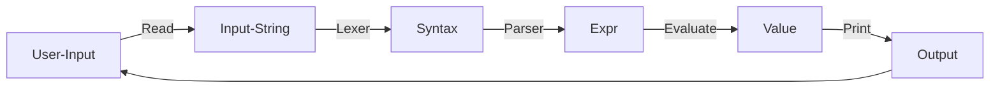

# Intro

<script src="https://cdn.jsdelivr.net/npm/mermaid/dist/mermaid.min.js"></script>
<script>mermaid.initialize({startOnLoad:true});</script>

这个文档用来介绍 `src` 子目录下文件的用处。

## 解释器介绍

在介绍 `src` 前， 我们需要先介绍一下解释器是如何运行的。 

在 REPL（Read-Evaluate-Print Loop）交互模式下， 用户输入的程序在输入时会被认为是一个完整的字符串， 这个字符串经过 Lexer 处理后分解成一个个的 tokens。 之后， 这些 tokens 会在 Parser 的作用下生成 AST（Abstract Syntax Tree， 抽象语法树）， 最终 AST 被交给求值部分进行求值并输出。

在我们提供的接口中， 已经为你实现了 Lexer 的部分， 由于 Scheme 的特性， 这些拆分出来的 tokens 已经组成了一个类似于 AST 的结构， 这就是 `Syntax`。

你需要实现的部分是 Parser（`parser.cpp`）和 Evaluation（`evaluation.cpp`）， 具体而言 `Syntax` 会被喂给你实现的 Parser 处理得到 `Expr`， 也即 AST。 这棵 AST 会交由 Evaluation 部分求值得到真正的值， 也即 `Value`。 最后， `Value` 会交给输出部分进行输出， 这一部分我们也已经为你实现了， 具体的实现在 `main.cpp` 中， 你可以参考或者修改这个文件获得一些调试上的帮助。



## 文件介绍

`src` 下文件为：

```
├── src
│   ├── shared.hpp
│   ├── parser.cpp
│   ├── evaluation.cpp
│   ├── main.cpp
│   ├── Def.hpp
│   ├── Def.cpp
│   ├── syntax.hpp
│   ├── syntax.cpp
│   ├── expr.hpp
│   ├── expr.cpp
│   ├── value.hpp
│   ├── value.cpp
│   ├── RE.hpp
│   ├── RE.cpp
│   ├── expr.hpp
│   └── expr.cpp
```

其中

```
├── src
│   ├── shared.hpp
│   ├── parser.cpp
│   └── evaluation.cpp
```

为你需要修改的文件
- `shared.hpp` 为 SmartPointer 作业中你实现的 `SharedPtr` 
> 对， 我们希望你能够使用自己的 `SharedPtr` 而不是 STL 的 `shared_ptr`， 至于为什么要用 `shared_ptr` 你可以思考一下）
- `parser.cpp` 是你需要实现的 Parser 部分， 你需要填写所有的 `parse()` 函数
- `evaluation.cpp` 是你需要实现的 Evaluation 部分， 你需要填写所有的 `eval()` 函数

对于其他的文件， 它们的用处分别为
- `Def.hpp`： 声明需要用到的类型、枚举类型和辅助函数
- `Def.cpp`： 定义了辅助函数和两个 `map`， 其中 `primitive` 用来存 `library` 函数的关键字， `reserved_words` 存其他语法的关键字（希望这两个函数和枚举类型能对你有所帮助， 当然你也可以不用我们提供的工具自己实现所有的功能， it's up to you）
- `RE.hpp` 与 `RE.cpp`： 定义了需要报错时需要使用的异常类型， 你需要学习异常类型的使用， 具体可以看[这里](https://www.runoob.com/cplusplus/cpp-exceptions-handling.html)
- `syntax.hpp` 与 `syntax.cpp`： 定义了所有的 `Syntax` 和[子类](https://www.runoob.com/cplusplus/cpp-inheritance.html)， 具体实现在 `syntax.cpp` 中
- `expr.hpp` 与 `expr.cpp`： 定义了所有的 `Expr` 和子类， 子类的构造函数在 `expr.cpp` 中
- `value.hpp` 与 `value.cpp`： 定义了所有的 `Value` 和子类， 子类的构造函数和输出方式在 `value.cpp` 中； 此外， 我们提到的作用域， 被实现在 `Assoc` 和 `AssocList` 中， 具体可以参考这两个文件
- `main.cpp`： REPL 的执行部分