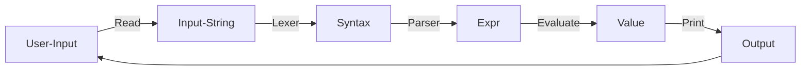

## Project 4: Scheme Interpreter

> SJTU CS1958-01 2024Fall 第四次大作业
>
> 本次大作业基于 SJTU CS1958-01 2023 Fall 第四次大作业改造而来，感谢陆潇扬学长与赵天朗学长！

作业提交截止时间：2024.12.24 18:00（暂定）

### 内容简介

在本次大作业中，你需要使用 C++ 实现一个简易的 Scheme 解释器。

#### Scheme

Scheme 是一种函数式语言，它主要有两种特性：

- 采用 S-表达式表示语句，除了 `int` 类型与变量 `var`，其余语法形如 `(expr exprs ...)`，例如 `(+ 1 3)`
- 函数也被视作一个变量

如果你对 Scheme 感兴趣，可以在网上自行查阅相关信息。本次大作业并不需要你实现 Scheme 所有的功能，因此阅读文档即可完成所有的需求。

#### 解释器

在 REPL（Read-Evaluate-Print Loop）交互模式下， 用户输入的程序在输入时会被认为是一个完整的字符串， 这个字符串经过 Lexer 处理后分解成一个个的 tokens。 之后， 这些 tokens 会在 Parser 的作用下生成 AST（Abstract Syntax Tree， 抽象语法树）， 最终 AST 被交给求值部分进行求值并输出。

在我们提供的接口中， 已经为你实现了 Lexer 的部分， 由于 Scheme 的特性， 这些拆分出来的 tokens 已经组成了一个类似于 AST 的结构， 这就是 `Syntax`。



### 项目框架

#### 编译

我们已经为你提供了 `CMakeLists.txt`， 要编译整个项目， 在根目录下输入

```
cmake -B build
cmake --build build --target myscheme
```

之后， `myscheme` 程序会生成在子目录 `bin` 下， 在根目录下执行

```
./bin/myscheme
```

来运行你的解释器。

#### 代码实现

`src` 下文件为：

```
├── src
│   ├── shared.hpp
│   ├── parser.cpp
│   ├── evaluation.cpp
│   ├── main.cpp
│   ├── Def.hpp
│   ├── Def.cpp
│   ├── syntax.hpp
│   ├── syntax.cpp
│   ├── expr.hpp
│   ├── expr.cpp
│   ├── value.hpp
│   ├── value.cpp
│   ├── RE.hpp
│   ├── RE.cpp
│   ├── expr.hpp
│   └── expr.cpp
```

其中

```
├── src
│   ├── shared.hpp
│   ├── parser.cpp
│   └── evaluation.cpp
```

为你需要修改的文件
- `shared.hpp` 为 SmartPointer 作业中你实现的 `SharedPtr` 
> 对， 我们希望你能够使用自己的 `SharedPtr` 而不是 STL 的 `shared_ptr`， 至于为什么要用 `shared_ptr` 你可以思考一下）
- `parser.cpp` 是你需要实现的 Parser 部分， 你需要填写所有的 `parse()` 函数
- `evaluation.cpp` 是你需要实现的 Evaluation 部分， 你需要填写所有的 `eval()` 函数

对于其他的文件， 它们的用处分别为
- `Def.hpp`： 声明需要用到的类型、枚举类型和辅助函数
- `Def.cpp`： 定义了辅助函数和两个 `map`， 其中 `primitive` 用来存 `library` 函数的关键字， `reserved_words` 存其他语法的关键字（希望这两个函数和枚举类型能对你有所帮助， 当然你也可以不用我们提供的工具自己实现所有的功能， it's up to you）
- `RE.hpp` 与 `RE.cpp`： 定义了需要报错时需要使用的异常类型， 你需要学习异常类型的使用， 具体可以看[这里](https://www.runoob.com/cplusplus/cpp-exceptions-handling.html)
- `syntax.hpp` 与 `syntax.cpp`： 定义了所有的 `Syntax` 和[子类](https://www.runoob.com/cplusplus/cpp-inheritance.html)， 具体实现在 `syntax.cpp` 中
- `expr.hpp` 与 `expr.cpp`： 定义了所有的 `Expr` 和子类， 子类的构造函数在 `expr.cpp` 中
- `value.hpp` 与 `value.cpp`： 定义了所有的 `Value` 和子类， 子类的构造函数和输出方式在 `value.cpp` 中； 此外， 我们提到的作用域， 被实现在 `Assoc` 和 `AssocList` 中， 具体可以参考这两个文件
- `main.cpp`： REPL 的执行部分

#### 评测

在 OJ 上进行提交测评， 我们也会下发部分数据来帮助你在本地进行调试。

具体而言， 有两种提交到 OJ 的测评方式

- 将整个文件夹压缩成压缩包在题面处上传， OJ 会根据根目录下的 CMakeLists 来构建你的程序。
- 在代码提交页面输入 `git` 仓库的地址。

#### 调试

在完成编译后，你可以运行你的解释器，并自行输入 Scheme 语言，检查你的解释器行为是否符合预期。

同时，我们在 repo 中提供了评测程序来对你的解释器进行本地测评， 评测程序在子目录 `score` 下， 评测数据在子目录 `score/data` 下。

具体而言， 评测程序会执行你的解释器并将结果与标准程序的输出进行比对， 要使用评测程序， 在子目录 `score` 下执行以下命令即可

```
./score.sh
```

若权限不够， 你可以输入下列命令后再执行

```
chmod +x score.sh
./score.sh
```

脚本中有两行

```
L = 1
R = 119
```

你可以将这两个变量改为任意数字来对给定范围内的测试点进行测评。

请合理利用本地的评测程序进行调试。

### 任务

总得来说，你的解释器应当可以接受以下语法：

```
expr   -->  Integer
		| 	Boolean
        |   (quote datum)
        |   var
        |   (if expr expr expr)
        |   (begin expr*)
        |   (lambda (var*) expr)
        |   (let ([var expr]*) expr)
        |   (letrec ([var expr]*) expr)
        |   (primitive expr*)
        |   (expr expr*)
```

对每一个输入的表达式， 你需要求出表达式的值， 值的类型有以下几种（可见于 `src/value.hpp`）

- `Integer`： 整数
- `Void`： `(void)` 时输出的值
- `Boolean`： 布尔值
- `Symbol`： 符号
- `Null`： 空 `Pair`（你可以认为是 C++ 中的 NULL）
- `Pair`： 值对， 由两个值构成
- `Terminate`： `(exit)` 函数的值， 负责退出整个程序
- `Closure`： 用户定义的函数

语法中的 `primitive` 为 Library 中定义的函数（你可以认为 Library 是 C++ 的 STL， 你同样需要实现这一部分函数的解释执行）。

#### 子任务 1（10pts）：计算器

我们从实现一个简易的计算器开始，在该子任务中，你的解释器应当可以接受以下语法：

```
expr   -->  constant
        |   (primitive expr*)
```

##### 语法：`constant`

在该子任务中，`constant` 表示整数，对应类型为 `Integer` 的值。在本次大作业中，你可以认为 `Integer` 就是 C++ 中的 `int`，你不需要考虑溢出等情况。

样例：

```
scm> 100
100
scm> -1
-1
```


##### 语法：`(primitive expr*)`

`primitive` 仅包含 `+,-,*,exit`，其中 `+,-,*` 表示基本的整数算术运算，接收两个类型为 `Integer` 的参数，并返回类型为 `Interger` 的值。

`exit` 没有参数，它会返回类型为 `Terminate` 的值，当 `main.cpp` 读入当前 `syntax` 并经过 `parse` 与 `evaluate` 后得到的 `value` 类型为 `Terminate` 时，`main.cpp` 会停止运行。

特别地，当 `primitive` 接收的参数个数或参数类型不符合要求时，你应当及时抛出异常（详见 `RE.hpp` 与 `main.cpp`）。**本次大作业不要求你抛出的异常指明具体的问题，你只需要抛出 `RuntimeError("Error.")` 即可。**

样例：

```
scm> (+ 1 2)
3
scm> (- 1 2)
-1
scm> (* (+ 1 2) (- 1 2))
-3
scm> (+ 1 2 3)
Error.
scm> (exit) // 程序终止
```

`exit` 没有参数，它会返回类型为 `Terminate` 的值，当 `main.cpp` 读入当前 `syntax` 并经过 `parse` 与 `evaluate` 后得到的 `value` 类型为 `Terminate` 时，`main.cpp` 会停止运行。

特别地，当 `primitive` 接收的参数个数或参数类型不符合要求时，你应当及时抛出异常（详见 `RE.hpp` 与 `main.cpp`）。本次大作业不要求你抛出的异常指明具体的问题，你只需要抛出 `RuntimeError("Error.")` 即可。

#### 子任务 2（10pts）：更多的数据类型

在该子任务中，我们将在上一子任务的基础上引入更多的数据类型以及对应的构造方式，你的解释器现在应当可以接受以下语法：

```
expr   -->  Integer
		| 	Boolean
        |   (primitive expr*)
```

`primitive` 在原来的基础上增加了 `quote, void, cons, car, cdr, not`。

我们首先来介绍该子任务中涉及到的数据类型。

##### 数据类型：`Integer`

`Integer` 属于基础类型，在本次大作业中，其行为与 C++ 中的 `int` 类型表现一致。

##### 数据类型：`Boolean`

`Boolean` 即布尔值，在 Scheme 中，我们使用 `#t` 表示 True，使用 `#f` 表示 False。

##### 数据类型：`Pair`

`Pair` 即二元有序对，它有两个值组成。在 Scheme 中，我们使用 `(A . B)` 表示一个左值为 `A`，右值为 `B` 的 `Pair`。

组成 `Pair` 的两个值的类型可以是任意类型，甚至也可以是 `Pair`，例如 `((1 . 2) . (3 . 4))`，它表示一个左值为 `(1 . 2)`，右值为 `(3 . 4)` 的 `Pair`。通过这种嵌套，我们可以用 `Pair` 表示一棵二叉树，进而表示更多、更复杂的结构。例如，我们可以使用 `Pair` 表示一个列表 `[1, 2, 3, 4, 5]`：`(1 . (2 . (3 . (4 . 5))))`，Scheme 会将其简写为 `(1 2 3 4 . 5)`。

##### 数据类型：`Null`

`Null` 可以被理解为空 `Pair`。在 Scheme 中，我们使用 `()` 表示 `Null`。